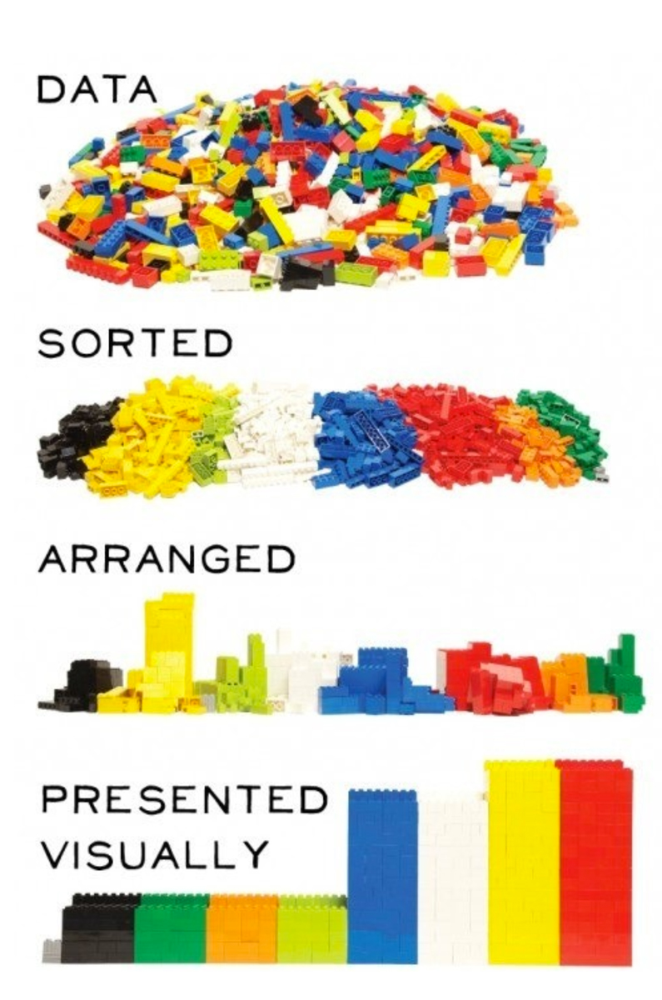
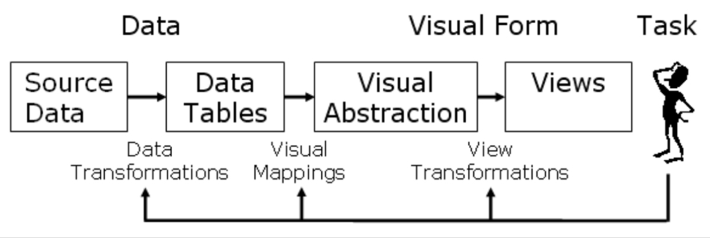
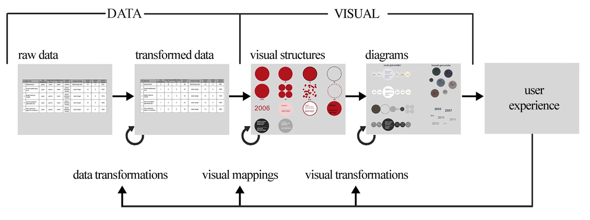

# I. Introduction to Data Design

We live in an era marked by an exponential inflation of data produced, generated, and exchanged digitally, approaching a global volume of nearly 5 billion terabytes. Faced with this informational deluge, design aims to play an essential role in, on the one hand, resolving the formalization and visual expression of these masses of data, and on the other hand, detecting new directions and purposes for their use or application.
— David Bihanic, Preliminary remarks for the exhibition 1 2 3 Data, Paris, 2018.

#

<iframe src="https://dataveyes.com/en" width="800" height="600" frameborder="0" allow="autoplay; fullscreen" allowfullscreen></iframe>

[DATAVEYES : 10 years of Human Data Interactions (showreel)](https://vimeo.com/495546114)

#

<iframe src="https://www.fathom.info/" width="800" height="600" frameborder="0" allow="autoplay; fullscreen" allowfullscreen></iframe>

[Fathom](https://www.fathom.info/)

#

{ width=500px }

Jacques Bertin, “Delimitation of the graphic system,” in Graphic Semiotics, original edition 1965.

# Terminology

- Diagram or graph
- Three dimensions: X, Y, Z
- Visual variables
- Time Series
- Network or Matrix
- Datasets
- Machine learning
- CSV (Comma Separated Value)
- JSON (JavaScript Object Notation)

# II. Methodology

{ height=500px }

Datas-légos

#

{ width=800px }

Ed Chi. A Framework for Information visualisation spreadsheets, PhD Thesis, University of Minnesota, 1999.

#

{ width=800px }

Handan Güzelci, A Diagrame-Based Interacrive Interface Design for Art Exhbitions, XXIIIGA2020, Argenia, Milano, 2020.

# III. Introduction to Digital Tools

<iframe src="https://mediafutureseu.github.io" width="800" height="600" frameborder="0"></iframe>

Digital methods, cf [MediaFutures Data Infrastructure](https://mediafutureseu.github.io/)

# 

<iframe src="https://p5js.org/" width="800" height="600" frameborder="0"></iframe>

Reminder about [p5.js](https://p5js.org/)