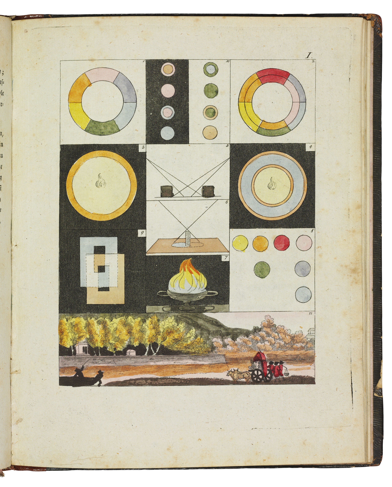
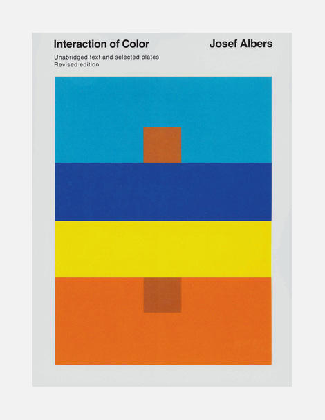
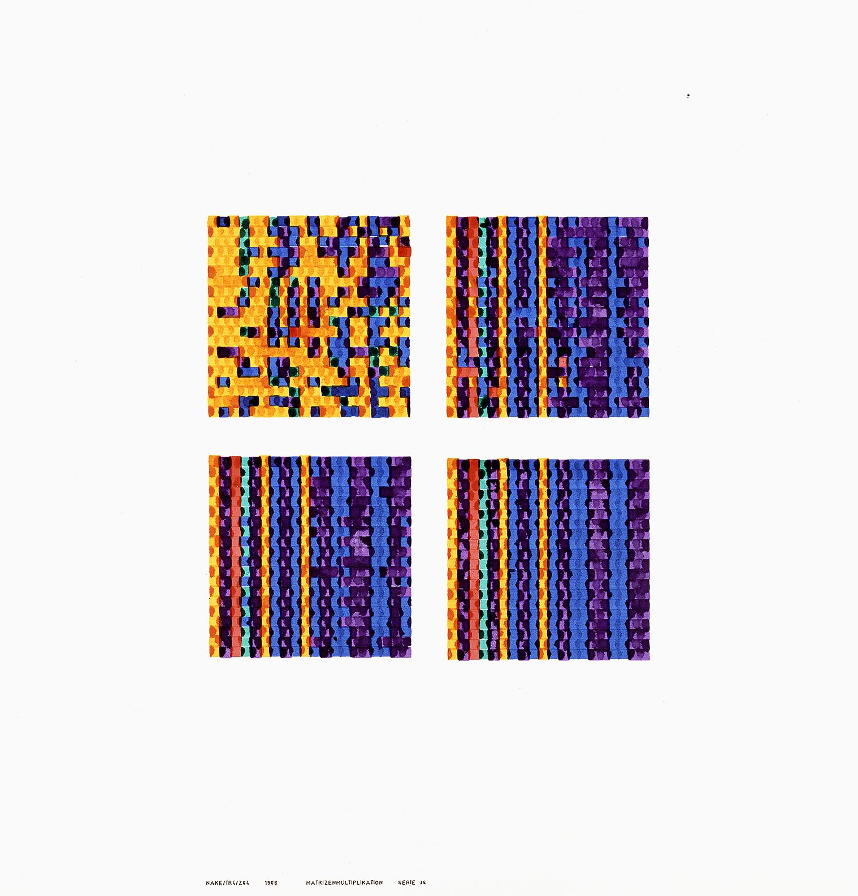
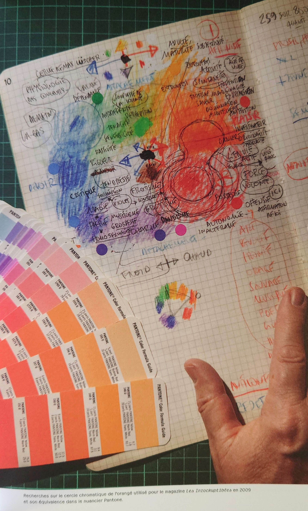

% The Story of Color
% Gaëtan Robillard, 2024.

# Summary

- Five Moments in Color
- Searching for Color
- GenAI Color

# Five Moments in Color

# I

#

{ height=550px }

Johann Wolfgang Goethe, *Theory of color* (Zür Farbenlehre), 1810.

#

{ height=550px }

J. W. Goethe, Ibid.

# II

#

{ width=450px }

Michel-Eugène Chevreul, *The principles of harmony and contrast of colours* (De la loi du contraste simultané des couleurs), 1828.

# III

#

{ width=550px }

Johannes Itten, *Three-Dimensional Thinking* (Dreidimensionales Denken), 1919-1920.

# IV

#

{ height=550px }

Josef Albers, *Interaction of color*, 1963.

#

{ height=550px }

Josef Albers, *Homage to the square: apparition*, 1959.

# V

#

{ height=550px }

Frieder Nake, *Matrix multiplication*, 1967.

#

{ height=550px }

Frieder Nake, *Matrix multiplication*, (1967-68).

# Searching for Color

#

{ height=550px }

Étienne Robial, Researching an orange color for *Les Inrockuptibles* magazine, 2009.

# GenAI Colors

#

{ height=550px }

Gaëtan Robillard, *Three lines in a latent space*, 2023.

#

{ height=550px }

Gaëtan Robillard, *Three lines in a latent space*, 2023.

#

<iframe src="https://robillardstudio.github.io/laion-aesthetics/pages/visual-huemap.html" width="1200" height="600" frameborder="0"></iframe>

LAION Aesthetics, 10K sample visualization, 2023. [https://robillardstudio.github.io/laion-aesthetics/pages/visual-huemap.html](https://robillardstudio.github.io/laion-aesthetics/pages/visual-huemap.html)
